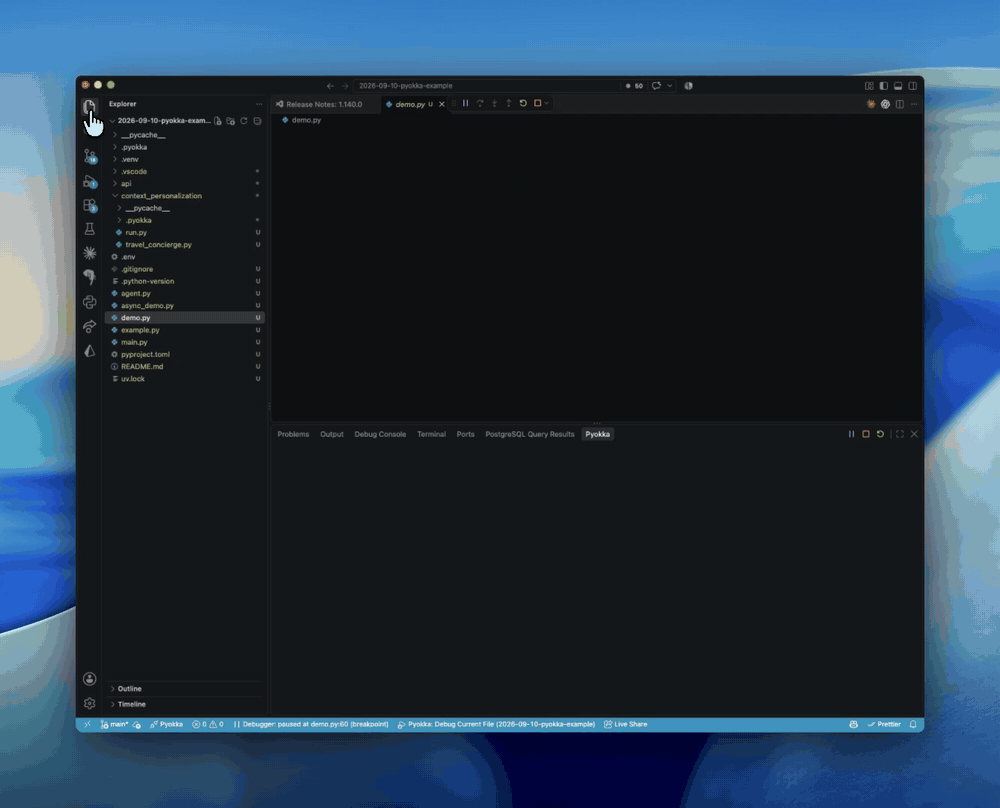
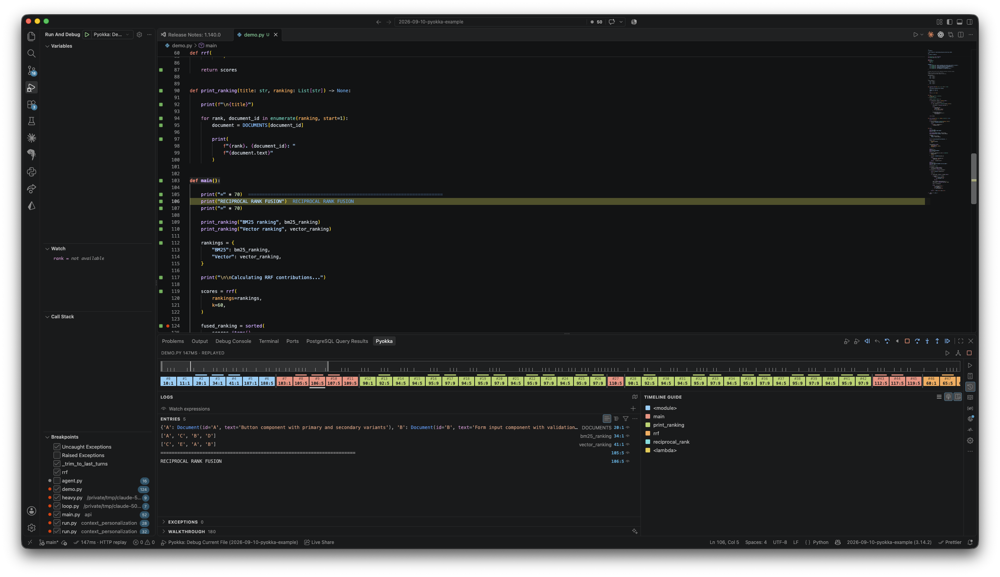
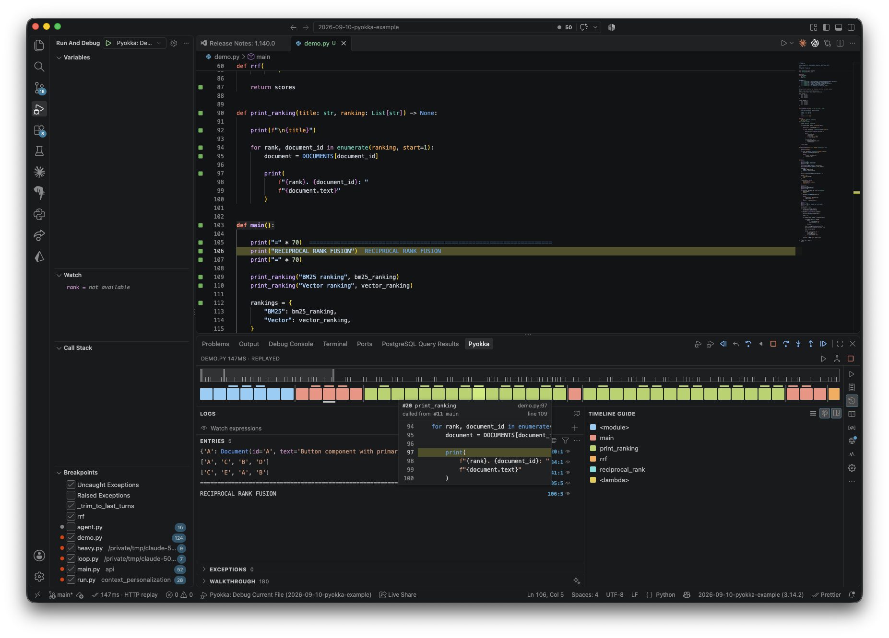
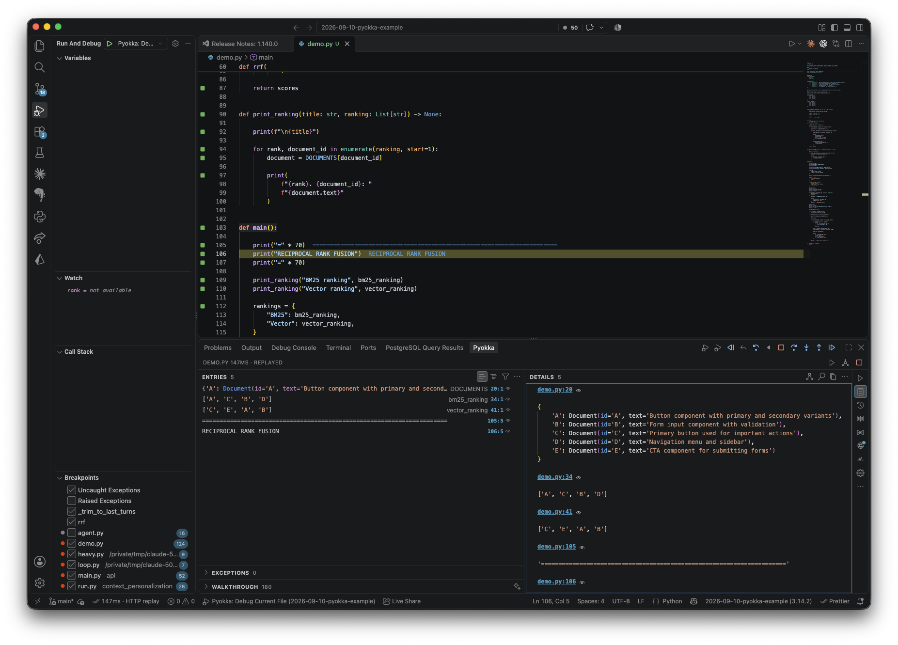
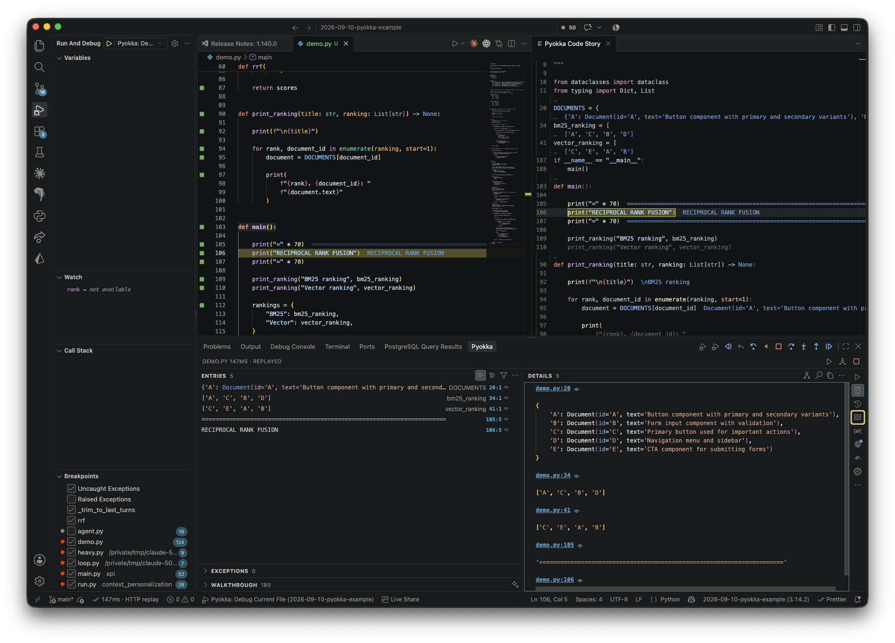
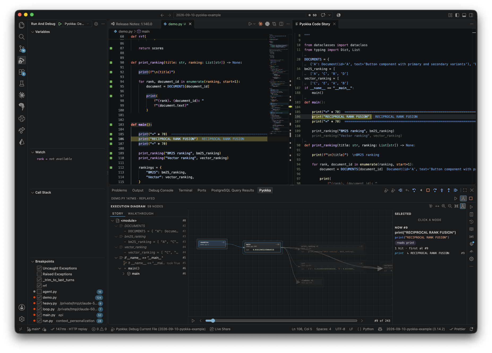

# Pyokka

Python playground in your editor: runtime values next to your code as you type,
live coverage in the gutter, an Output & Details panel, and a time-travel
debugger with an interactive timeline you can step through forwards **and
backwards**. Inspired by [Quokka.js](https://quokkajs.com), the JavaScript
playground, and with one thing Quokka does not have: a `pyokka` command line
that reads a recorded run the way the Time Machine does, so an agent (or you,
in a terminal) can ask what a program did instead of reading it.

Pyokka is an independent project, not affiliated with Wallaby.js, the maker of
Quokka. It contains no Quokka source code. Its command names, settings and keys
follow Quokka's so that the two feel the same in the editor, and `examples/demo.py`
follows the outline of Quokka's interactive demo, rewritten in Python.

https://github.com/user-attachments/assets/f9330b28-e8c5-49f2-838b-2ce495ab4d8d

[](docs/media/pyokka.mp4)

*An agent drives the debugger from a terminal: `pyokka debug demo.py --at rrf --at reciprocal_rank
--at demo.py:124`, then `continue` and `step` from stop to stop. The editor shows each pause with
its values on the line, and the Pyokka panel has the call stack, the locals and the program's
output. Click it for [the video](docs/media/pyokka.mp4).*

Requires Python 3.12 or newer and VS Code 1.93 or newer. The runtime is pure
standard library and ships inside the extension; nothing is installed into your
environment.

Contents: [In pictures](#in-pictures) · [Two products](#two-products) · [Install](#install) · [Quick start](#quick-start) · [Live values](#live-values) ·
[Coverage](#coverage) · [Run modes and code with side effects](#run-modes-and-code-with-side-effects) ·
[The Pyokka panel](#the-pyokka-panel) · [Time Machine](#time-machine) · [Code Story](#code-story) · [Debugger](#debugger) ·
[Understanding a run](#understanding-a-run) · [HTTP: observe, record, replay](#http-observe-record-replay) ·
[Secrets](#secrets) · [More features](#more-features) · [Agent access: the pyokka CLI](#agent-access-the-pyokka-cli) ·
[Configuration](#configuration) · [Settings reference](#settings-reference) · [Commands and keys](#commands-and-keys) ·
[Files Pyokka writes](#files-pyokka-writes) · [Development](#development) · [Status](#status)

## In pictures

All five from one recorded run of `examples/demo.py` (reciprocal rank fusion over two rankings).



**Time Machine.** The strip at the top is the whole run: a notch per step, then one block per step,
coloured by the function it ran in (the TIMELINE GUIDE on the right names the colours). The editor
shows the value each line produced at the step you are on, and LOGS lists every logged value with
the line it came from. `Shift+F5` on a line starts it there; every move replays the recording, so
nothing runs again.



**Hover a step.** A block previews the code at that step, with the function and the step and line
that called it: here `#20 print_ranking`, called from `#11 main` at line 109.



**Output and Details.** ENTRIES is every logged value, print and error, each with its `line:col`.
DETAILS shows them in full, nested values expanded, each under a link to its line.



**Code Story.** Beside the source, the lines that actually ran, in the order they ran, each with the
value it produced. Functions appear where they were called, so the file reads as the program
executed it, not as it was written.



**Execution diagram.** A card per module and function that ran, with its call count and its first
call's arguments and result, and the calls between them. STORY on the left is the same run as an
outline; the slider at the bottom replays it step by step (`#9 of 243`), and SELECTED says what the
current step did.

## Two products

Pyokka ships two things. They share a runtime, a runner and VS Code's gutter
breakpoints, and nothing else.

**Run-all** is the playground: it runs the file on save (or as you type),
records every statement, shows values next to your code, and lets you navigate
the recording in the Time Machine, read it as a Code Story and ask `why`. It is
what the rest of this README is mostly about.

**The Debugger** is a normal debugger. It starts a program (a script, a module
with arguments, a server) and runs it at full speed until a breakpoint or an
exception. You pause, step, inspect, continue, stop. Nothing is recorded,
nothing re-runs, nothing is "finished": when the program exits the session is
gone. `F5` on a Python file starts it; so does `pyokka debug FILE` from a
terminal.

Which one you want:

| you want to | use |
|---|---|
| see what every line produced, and go back | run-all |
| ask why a value is what it is | run-all |
| run a server or a CLI and stop in a handler | the Debugger |
| pass arguments, an environment or a module name | the Debugger |
| inspect a program that runs for minutes | the Debugger |
| both, at one pause | the Debugger with `"record": true` |

Recording is the optional bridge. `"record": true` in a launch configuration
makes a debug session also record, and then the Time Machine opens over that
recording at every pause. It is off by default and slower, and it needs a
`program` (a module launch has no document for a run-all session to hang on).

A file can have a run-all session and a debug session at the same time: separate
processes, separate children, separate panels. They share the gutter and nothing
else.

## Install

Pyokka is not on the Marketplace yet. Download the `.vsix` from the latest
[GitHub release](https://github.com/ivorpad/pyokka/releases/latest) and install it:

```sh
gh release download --repo ivorpad/pyokka --pattern '*.vsix' --clobber
code --install-extension pyokka-*.vsix --force   # Cursor: cursor --install-extension ...
```

Or install it from the Extensions view: "..." menu, "Install from VSIX...". To build it
from source instead:

```sh
npm install
node esbuild.mjs --production && ./node_modules/.bin/vsce package --no-dependencies --allow-missing-repository
code --install-extension pyokka-*.vsix --force
```

Then run "Developer: Reload Window" in every open window. Installing never
restarts a running extension host; the status bar tooltip shows the build
timestamp of the extension a window is actually running, so a stale window is
easy to spot.

To try it without installing, open this repository in VS Code and press `F5`:
the Extension Development Host opens `examples/`, whose workspace settings pin
the Automatic run mode so the demo re-runs as you type.

Cursor works with the same `.vsix`. Every `Cmd/Ctrl+K` chord below is also
`Ctrl+Alt+P` plus the same letter, because Cursor takes `Cmd+K` for itself.

## Quick start

Open a Python file and press `Cmd/Ctrl+K Q` ("Pyokka: Start on Current File").
The file runs, values appear beside the lines that produced them, the gutter
shows what ran, and the Pyokka panel opens at the bottom. Save to run again (the
default mode), or switch the session to Automatic in the panel's Settings to run
on every edit.

The first activation opens a start view with a "Launch Interactive Demo" button.
It starts a session on an untitled copy of `examples/demo.py`, which walks
through logging, coverage, the Time Machine, a loop to step through and an error
in one file. "Pyokka: Open Start View" brings the view back.

| Action | Key |
|---|---|
| Start on the current file | `Cmd/Ctrl+K Q` |
| New Python file, session started | `Cmd/Ctrl+K J` |
| New file from a snippet or a recent file | `Cmd/Ctrl+K L` |
| Stop the current session | `Cmd+K S` (mac) / `Ctrl+K E` |
| Re-execute the file | `F5` (Time Machine idle, no breakpoint in the file) |
| Show value of the selection | `Cmd/Ctrl+K V` |
| Copy value | `Cmd/Ctrl+K X` |
| Clear a shown value / all shown values | `Esc` / `Esc Esc` |
| Install the missing package for this file | `Cmd/Ctrl+K I` |
| Start or stop the Time Machine on the current line | `Shift+F5` |
| Step over / back over | `F10` / `Ctrl+F10` |
| Step into / back into | `F11` / `Ctrl+F11` |
| Step out / back out | `Shift+F11` / `Ctrl+Shift+F11` |
| Run to / back to the cursor line | `F5` (no breakpoint in the file) / `Ctrl+F5` |
| Run to / back to a breakpoint | `F8` / `Ctrl+F8` |

`Esc` clears the values you asked for with Show Value; `# ?` values stay. The
Time Machine keys work while a Pyokka session's file (or its Code Story) is the
active editor and no VS Code debug session is running.

## Live values

### print, names and live comments

`print()` output appears beside the call instead of in a terminal
(`file=sys.stderr` is logged with the context `stderr`; other `file=` targets
pass through untouched). A name alone on a line shows its value. A live comment
after any expression asks for more:

| Comment | Shows |
|---|---|
| `x  # ?` | the value of `x` |
| `x  # ?+` | the value, expanded deeper (depth 10 instead of 5) |
| `f()  # ?.` | how long the expression took, aggregated over its hits: count, total, min, max |
| `f()  # ?.+` or `# ?+.` | both |
| `s  # ? $.upper()` | the result of the code run against the value, `$` being the value |

Comments are found with `tokenize`, so a `# ?` inside a string is not a marker,
and a `# ?` followed by words that do not parse as an expression is an ordinary
comment. Third-party files honour no live comments, even when library stepping
is on.

Every logging site keeps its last `pyokka.logLimit` values (100) and a run keeps
`pyokka.maxConsoleMessages` (1000). Long strings and big collections are cut;
the Details pane offers "Load more" and "Load full string value", answered by
the finished run's process without a re-run.

A coroutine that is the value of a bare expression logged with `# ?` is run to
completion (`asyncio.run`, or scheduled on the running loop). Tasks and Futures
are logged when they complete. A coroutine bound to a name is shown as
`<coroutine ...>` and left alone.

### Show Value, selection and Auto Log

- `Cmd/Ctrl+K V` shows the value of the selection, or of the member chain under
  the cursor (`self.balance`). The marker sticks across runs until `Esc` on its
  line or `Esc Esc` for the file. "Show Line Value(s)" and "Show Line Timing(s)"
  do the same for every expression on the line. `Cmd/Ctrl+K X` copies the value.
- "Show Value On Selection" shows a value whenever you select an expression
  (multi-line selections need `pyokka.showValueOnMultilineSelection`).
- "Show Last Displayed Value Only" (the default) replaces the previously shown
  value; "Show All Displayed Values" keeps them all.
- "Auto Log" shows a value for every statement: assignments, returns,
  conditions. Toggle it from the palette, the status bar menu or the panel's
  Settings, or set `pyokka.autoLog` as the default. The Time Machine switches it
  on while you navigate.
- Logpoints: a VS Code logpoint (right-click the gutter, "Add Logpoint") with
  `{expr}` interpolation logs at that line. In Automatic mode a logpoint change
  re-runs the file; in the other modes it waits for the next run.

Inline text colours follow the theme and can be overridden per kind (`log`,
`system`, `error`) through the `pyokka.lightTheme.*` and `pyokka.darkTheme.*`
settings.

### Value Peek: hover

Hovering a name or a member chain shows its value with links: **Explore value**
(opens it in the Details pane), **Show as diagram**, **Copy**, **Why** (the
provenance tree, see below) and, while the Time Machine navigates, **Add
watch**. The links keep working after the file re-ran: a click whose entry
belongs to a replaced run re-evaluates the expression against the current one.

Where the value comes from depends on the mode. A value already recorded for
exactly that expression needs no run. A bare name that nothing recorded there
(a parameter, a local) is answered from the run's recorded variables when
"Record Variable Changes" is on: the value as of the current step while the
Time Machine navigates, the last change otherwise, with the step and function
in a footer. Otherwise, in Automatic mode the file runs once more with a
transient marker; in On Save and On Demand the finished run's process evaluates
names, attributes, subscripts, operators and pure calls (builtins like `len` and
`sorted`, non-mutating methods such as `d.get("k")`) against the final module
state, refusing a function of your own, and the hover says so. When
nothing can be shown in those modes, the hover places a hidden marker at the
spot so the next save or Re-execute records it (the status bar reads "run
needed"), and offers "Record variables and re-run": one click turns recording
on for the session and runs once, after which every local answers a hover at
every step. `pyokka.valuePeek` and the session checkbox turn hovers off;
`pyokka.resolveGetters` lets serialisation invoke properties.

## Coverage

Gutter squares show what ran: green executed, grey never executed, yellow
partially executed (a short-circuit or a ternary whose other arm never ran), red
the statement that raised, pink the statements on the error's path. Colours come
from `pyokka.colors` (a restart applies them). After an edit the previous run's
coverage is drawn as stale until the next run.

`# ignore coverage` or `# pragma: no cover` on a line drops it from coverage; on
a compound statement the whole block is ignored. `# ignore file coverage`
anywhere ignores the file. `def` and `class` statements and class bodies are
coverage-only: they show as covered, and the Time Machine never stops on them.

## Run modes and code with side effects

The default run mode is **On Save**: the file runs when you save it, and
otherwise only on an explicit Re-execute. **Automatic** mode runs on every edit
(after `pyokka.delay` milliseconds), and also for a hover (Value Peek), a new
watch expression, a Show Value marker, a logpoint change, an edit to an imported
project file and when the Time Machine switches Auto Log on; each of those is a
full run, which matters for a file that calls an API. **On Demand** runs only
when you ask. **Smart** gives scratch files (untitled, or in a folder without
`pyproject.toml`, `setup.py`, `setup.cfg`, `requirements.txt`, `Pipfile` or a
lock file) Automatic and project files On Save.

In On Save and On Demand nothing executes except an explicit Re-execute (`F5`,
the run button in the editor title, the play button in the panel rail, the
status bar item), a save, a restart, a profile run, a package install or a snaps
run. Requests that would need a run are queued and the status bar reads "run
needed". Hovers show recorded values or, for names, attributes and subscripts,
the value from the last run evaluated in the still-alive run process. Edit a
statement and its new value appears at once, marked `≈`, computed from the
captured data (prints, expressions and assignments; a call to a function of your
own waits for the next run). Inline values on lines edited since the last
run are hidden until it. Stepping in the Time Machine never executes anything
in any mode.

Change the mode in the panel's Settings, the session menu ("Pyokka: Edit
Current Pyokka Session Settings"), the palette ("Run on save / automatically /
on demand for Current File") or `pyokka.runMode` for new sessions. The mode is
per session and the panel never writes it to your user settings (an earlier
build did; check your settings for a leftover `pyokka.runMode`). A notice
explains On Save the first time a session starts in it, and Automatic the first
time a session starts in that, once per user.

A run is killed after `pyokka.runTimeout` milliseconds (30 s), wall time with
network waits included; the panel's Settings offers 30 s to 10 min or no limit
per session. When a run is killed the entries pane says so and links to the
setting. Time spent instrumenting files is not counted.

## The Pyokka panel

The panel is a view in VS Code's bottom panel (the "Pyokka" tab), shown once a
session exists (`pyokka.showOutputOnStart` opens it when a session starts,
`pyokka.fontSize` sizes its text). A vertical rail on the left switches views:

| Rail button | Does |
|---|---|
| Play | Re-execute; spins while a run is in flight, and a click then restarts the run |
| Output | the Output view |
| Clock | starts the Time Machine on the current line, or shows its view while navigating |
| Book | View Code Story |
| `(x)` | the Variable pane |
| Globe | the HTTP view; carries a badge while the session records or replays |
| Pulse | Profile |
| Gear | Settings |
| `…` | Show Execution Diagram, View Recent Files, Show Instrumented File, Edit Session Settings, Show Pyokka Logs |

The header shows the session's file and the last run's duration (`· replayed`
after an HTTP replay). While the Time Machine navigates it also holds Auto play
/ Pause, Show execution diagram and a close button.

The panel is the whole run; the moment you are on is VS Code's. The call stack,
the variables at the current step and the step buttons live in the Run and Debug
side bar and the debug toolbar, because the Time Machine and the debugger are
both VS Code debug sessions (see [Time Machine](#time-machine) and
[Debugger](#debugger)). The panel does not repeat them.

**Output view.** ENTRIES on the left: every logged value, print and error, as
a list with details or as a tree by file and line (hide a file or a line from
the tree's menu), with a text filter and menu toggles for the kind icon, the
file name in source links and the value context. A source link jumps to the
line and its eye icon opens the file to the side; the `?` button on an entry
opens its "why" tree. "RUNNING…" replaces the list while a run is in flight.
DETAILS on the right renders the selected entries (all of them when none is
selected) in a Monaco editor: Find, Copy with highlighting, a menu for line
numbers, minimap, sticky scroll and folding, and a context menu with Copy value,
Copy path, Load full string value and Load more. Select two entries and the
Compare button diffs them (a message says when two values cannot be diffed).
Show as diagram draws the selected value as a tree you can zoom, fit and copy
paths from. Under the entries, the EXCEPTIONS, WALKTHROUGH and TOUR sections (see
[Understanding a run](#understanding-a-run)) collapse and expand.

**Settings view.** The current session's settings, applied immediately: Auto
Log All Values, Value Peek, Show Value On Selection, Show Last Displayed Value
Only, Step Into Library Code, Mask Secrets, Record Variable Changes, then the
Run Mode, the Run Timeout and the HTTP mode as dropdowns. The save button makes
the current values (the run mode excepted) the defaults for new files, the
discard button resets them, the history button opens Recent Files. Tooltips on
every icon appear after 150 ms.

**Status bar.** One item on the left: idle (`Pyokka`), running (a spinner,
with a file count while a run instruments libraries), finished (`✓ 46ms`, plus
`· recorded N`, `· replayed` or `· HTTP replay` for the HTTP layer), failed (a
warning with the error in the tooltip), or `Pyokka: run needed` when a request
waits for a run in On Save or On Demand. A click opens a menu: start view,
output pane, stop, the Auto Log and selection toggles, recent files, session
settings, interpreter, logs. The tooltip names the run mode and the build
timestamp.

## Time Machine

Press `Shift+F5` on any line (or the clock in the rail) and the Time Machine
starts at that line's first step; `Shift+F5` again stops it. It needs a
recorded trace: in On Save and On Demand without a run yet it asks you to
Re-execute first, and a file with no executable statement says so. Every move is
a replay of the recording. Nothing runs.

The panel switches to the Time Machine view: two strips at the top (the
timeline, with a notch per step and errors marked, and the steps, one block per
step coloured by function and labelled `#23` over `line:col`), the LOGS pane
with the watch expressions and the entries, and the TIMELINE GUIDE (the colour
of each function) on the right. Click a block to jump, drag the window to
scroll, wheel to zoom. Hovering a block previews the code with the step number,
the function and, inside a call, which step and line called it. The guide's
toolbar toggles the current step echo (the other blocks of the same statement
highlighted on the strip) and the code preview.

**A debug session in replay.** Opening the Time Machine also opens a VS Code
debug session over the recording, named `Pyokka Time Machine: demo.py`, and
closing it ends that session (Stop in the debug toolbar closes the Time Machine
too). The Run and Debug side bar then shows the moment you are on: Call Stack
is the stack at the current step, innermost first, each caller at the step that
called it, and clicking a caller moves the Time Machine to that step; Variables
lists each frame's values as the recording has them at the step (the values
Auto Log and `# ?` logged under a name, and every local with "Record Variable
Changes" on); Watch and hovers answer a recorded name and its members (`x`,
`row['score']`, `items[0]`) and say when the recording does not hold an
expression, because nothing runs. Right-click a variable for Why This Value.
The debug toolbar steps: Step Over, Step Into, Step Out and Continue (to the
next breakpoint, else the end of the recording) go forward, Step Back (back
over) and Reverse Continue (to the previous breakpoint, else the first recorded
step) go backward. Every move, from the toolbar, the panel's strips, the Code
Story or an agent's `pyokka step --live`, moves the one Time Machine, and the
side bar follows it.

Moves: Step Into (`F11`) goes to the next step, into a call when there is one.
Step Over (`F10`) stays in the current scope or an ancestor, so it skips a whole
`await asyncio.gather(...)`. Step Out (`Shift+F11`) returns to the caller after
the call. While the replay session is open these three keys, and `F5`
(Continue), are VS Code's own debug keys, sent to the session. Run to Breakpoint
(`F8`; VS Code breakpoints in the file are the targets) goes forward until a
match, and each move has a backward twin with `Ctrl` (Step Back Into
`Ctrl+F11`, Step Back Over `Ctrl+F10`, Step Back Out `Ctrl+Shift+F11`, Run Back
to Active Line `Ctrl+F5`, Run Back to Breakpoint `Ctrl+F8`); those keys work in
the replay session too, and the Code Story's title bar has them all as buttons.
Run to Active Line (`F5`) applies while no debug session is open. Auto Play
advances one step every `pyokka.codeAutoPlayDelay` milliseconds (1000) until
Pause.

`def` and `class` statements and class bodies produce no steps; entering a
function on a call is a step, and a loop header is a step per iteration.
Gathered tasks each sit under the module in the call stack with their own calls
beneath them, instead of nesting under whichever task ran last.
`pyokka.maxTraceSteps` caps the recording; a "Trace truncated" mark appears on
the strip when it hit.

**Values follow the step.** While the Time Machine is on, each inline value is
what its statement had produced by the current step: the current step's values
in full, earlier ones dimmed, nothing yet for a statement that has not run, and
a loop line reads `×2 3` on its second pass instead of the run's last hit.
Hovering a value or a name shows that entry without a re-run, with a footer
`as of step 27; final: 6` when the run ended with a different value and `not
run yet as of step 5; final: 6` before the statement's first hit.
`pyokka.timeMachine.inlineValues` switches to only the current step's values
(`currentStep`) or to the unchanged last hits (`all`). Stopping the Time Machine
restores the final values. Auto Log is switched on while navigating
(`pyokka.timeMachine.autoLog`) so every step shows the value its statement
produced, return values inside functions included.

**Watch expressions.** "Add Watch Expression" (the hover's Add watch link, the
command on a selection, or an input box) evaluates an expression at the current
step and prefetches the next ten, so stepping is instant. Refresh, explore,
copy or remove them in the LOGS pane. Outside Automatic mode a watch never
runs the file: at a debug pause it evaluates in the paused frame, at the run's
last step the finished program answers, behind that a bare name answers from
the recorded variables as of the step (the row says where it was recorded), and
an expression nothing recorded at an earlier step says "not recorded at this
step" with an Evaluate action that runs the file once to record it there. The
recording holds the steps, the logged values and the locals' text, not every
expression at every step, so that one run is what it costs; while a debug run
is paused no run can start, and the paused frame answers at the frontier.
The + in the Watch expressions header and double-click on a row edit an
expression in the panel, with completion as you type: names in scope for a
bare prefix, the object's attributes after a dot, from the paused frame while
a debug run is paused and from the finished run otherwise. Up/Down choose, Tab
or Enter accept, Escape closes the list, then cancels; Tab with no list asks
for one and stays in the field; clicking elsewhere to copy a value keeps what
you typed. VS Code's Watch pane and Debug Console get the same completions in
the debug session.

**Recorded locals.** With "Record Variable Changes" on (Settings, or
`pyokka.timeMachine.recordLocals`), every local is recorded whenever it changes,
and VS Code's Variables view lists each frame's locals at the current step. The
runtime keeps at most 100 000 entries per run.

**Edit and continue.** Editing the file while navigating keeps the Time Machine
on the same statement: the next run re-anchors the step.

**Library code.** Library code is a single step by default. Turn on "Step Into
Library Code" (panel Settings, or `pyokka.timeMachine.libraryCode`) and re-run
to step into third-party packages; `pyokka.timeMachine.libraryPackages` limits
it to named packages or dotted globs. Third-party code is stepped where your
code calls it; what a package runs while importing (pydantic building its
models, say) counts for coverage but records no steps. The standard library is
never instrumented. Instrumented library files are cached in `~/.pyokka/cache`
("Pyokka: Clear Library Cache" or `pyokka cache --clear` empties it; the next
run rebuilds what it needs), so the first run with the option on is the slow
one: importing `openai` with every package on took 2.5 s cold and 0.8 s warm on
the machine this was measured on (`scripts/measure-library-run.py`), against
0.6 s with the option off.

## Code Story

"Pyokka: View Code Story" (the book in the rail) opens a read-only document
beside the editor that lists the source in the order it ran. Opening it starts
the Time Machine when it is not on, and the document lives as long as the Time
Machine does. Stopping the Time Machine, or the session, closes it. There is no
stopped state to read.

The first row is empty, then the blocks follow. One block is one pass through a
scope. A block ends where the scope changes or where a line comes back around,
so a loop body is listed once per iteration and a call splices the callee in
under its call site. Between two blocks there is one row holding `…` and nothing
else, no blank row and no heading. Every other row is a source line number,
right-aligned to the width of the file's line count, then two spaces, then the
source line.

A block lists the lines its pass ran plus two lines of source either side of
them, clamped to the scope. For a function that span runs from the `def` line
(with the comments and decorators directly above it) to the end of its body, for
the module scope it is the file. Blank lines at the top or bottom of the window
are dropped, blank lines between two listed lines stay, and an interior stretch
of more than four lines the pass did not run folds to one `…` row. A function's
`def` line is listed when it falls inside that window and not otherwise, so a
first pass through a short function shows it and a later turn deep in a long
body does not. On a line that ran, the columns of the step's range are painted
in full colour and the rest of the line is dimmed. A line that is only there for
context is dimmed throughout.

Lines show the values they logged, with the same `×N` hit prefix and the same
text as in the editor (cut at 120 characters, the whole value on hover), at the
end of the statement's row, or on the `…` row under it when the block folded
the statement's tail away. `pyokka.story.values` picks which: `all` (the
default) paints every block's values during that block's steps, so each turn
of a loop carries its own; `asOf` hides what the run has not reached yet;
`step` shows only the current step's, which is what Quokka does. The current
step is boxed on its range, and every move scrolls the story to it and puts the
story's cursor on that row.

Putting the cursor on a story line does not move the Time Machine. Selecting
text on a single story line does move it, to that line's first step in that
block, and adds a Show Value marker on the source. Hovering a
name shows the value the editor's Value Peek shows for it, and Go to Definition
opens the source at that line. Project and library modules that ran are read
from disk when they are not open. With `pyokka.story.walkthrough` on (off by
default), the walkthrough below is listed at the top.

## Debugger

"Pyokka: Debug Current File", or the Debug button in the panel's title, or `F5`
on a Python file, starts the program under the debugger. It runs at full speed
until a breakpoint or an exception; with no breakpoint it runs to the end, as
any debugger does, and `"stopOnEntry": true` pauses before the first statement
instead. `F5` starts a debug session when the active file holds a breakpoint,
and when no Pyokka session is running on the file; with a session and no
breakpoint it re-executes or moves the Time Machine instead, so "Commands and
keys" lists what `F5` does in each state.

Nothing is recorded by default, so there is no Time Machine over a debug
session, no values behind the pause and no `why`. What there is: the stack with
real caller lines and the paused frame's variables in the Run and Debug side
bar, Continue, Step Over (`F10`), Step Into (`F11`), Step Out (`Shift+F11`),
Restart and Stop on the debug toolbar, and the watches, the breakpoints and the
program's output as it arrives in the panel. A paused program is off the
run-timeout clock, whatever `pyokka.runTimeout` says. Editing while paused is
allowed and is not applied: what runs is what is on disk, so the edit takes
effect at the next start.

**The Debugger view.** While a debug session exists the panel's rail grows a
`debug-alt` button next to the Time Machine's, and starting the session brings
the panel up on that view, under the same `pyokka.showOutputOnStart` a run
obeys (the caret stays in the editor). The view says where the program
paused and why, lists the watches (break-when ones included), the breakpoints
with the exception mode next to them, and the program's output as it is
printed. The call stack, the frame's variables and the step buttons are VS
Code's Call Stack, Variables and debug toolbar over the same session; clicking
a frame there scopes the variables and the Debug Console to it. The status bar reads
`Debugger: paused at app.py:42 (breakpoint)`, or `Debugger: running`. When the
program exits the session is disposed and the panel goes back to the view it
was showing before.

While the program is running the sections are ordered by what is live: output
leads and takes the free space, because a watch has no value until a stop (it
says `at the next pause`). The
pane follows its own tail and parks when you scroll up, so a program that prints
for minutes does not leave you watching a stale window. Above it a row says how
long the run has been going, how much it has printed, how long ago the last byte
came, and draws characters per half second over the last twenty — which is how
you tell a program awaiting a slow model from one that is wedged. At a stop the
order goes back to watches, breakpoints, output.

The pane knows which stream a line came from: stderr keeps its own colour and
can be hidden, which matters when a library logs to it. ANSI colour from `rich`
or `colorama` is painted with the terminal's own theme colours rather than
printed as escape codes, `\r` shows the last frame of a progress bar instead of
every step, a silence of more than a few seconds is marked between the lines
either side of it, and the line the program is still writing — what
`print(delta, end="")` produces while a model streams tokens — is shown as it
grows.

**Launch attributes.** No `launch.json` is needed: `F5` hands VS Code's empty
configuration to Pyokka's provider, which runs the active Python file. A
configuration pins more:

| attribute | default | what it does |
|---|---|---|
| `program` | `${file}` | the Python file to run; give this or `module` |
| `module` | | a dotted name run like `python -m`, instead of `program` |
| `args` | `[]` | arguments for the program (`sys.argv[1:]`) |
| `cwd` | `${workspaceFolder}` | working directory the program runs in |
| `env` | `{}` | environment variables added to the program's environment |
| `python` | | interpreter to run with; the Python extension's environment, then `pyokka.python.interpreter`, then `python3` |
| `stopOnEntry` | `false` | pause before the first statement instead of running to the first breakpoint |
| `breakOnException` | `uncaught` | `off`, `uncaught` or `raised` |
| `libraryCode` | `false` | step into third-party packages (never the standard library) |
| `record` | `false` | also record the run, so the Time Machine, the Code Story and `why` open over it at every pause |

```json
{ "type": "pyokka", "request": "launch", "name": "Pyokka: Debug Module",
  "module": "app.server", "args": ["--port", "8000"], "cwd": "${workspaceFolder}" }
```

A second start on the same program and working directory restarts the session
in place rather than opening a second toolbar; a different `args` or `cwd` is a
different session and runs beside it.

**Servers, and reload mode.** A server runs until a request arrives, and then
the breakpoint in the handler hits. Continue answers the request; two requests
in flight pause one after the other, each named with its thread; Stop kills the
server. One catch: `uvicorn --reload` and `flask --debug` spawn a worker process
and watch the files from the parent. The debugger runs the parent, so its
breakpoints never hit and the panel shows a program that does nothing. Drop the
flag (`--args` without `--reload`), or point the launch at the worker command.

A breakpoint inside a library module's import-time body does not pause; one in
a library *function* pauses when your stepped code calls it, with
`"libraryCode": true`.

### With recording

`"record": true` is the other half, and "Pyokka: Debug Current File
(Recording)" is the one-click way in (it sits next to the Debug button in the
panel's title, and `pyokka debug FILE --record` is the same start from a
terminal). The run is recorded and the pause is the frontier. Behind it is what Pyokka recorded, and it is the Time Machine's:
values as of the step, Step Back, the Code Story, Why. At it the frame is live:
hovering evaluates in the real frame, the Variables view lists its variables,
watches evaluate without a re-run. Continue, Step Over, Step Into and Step Out
then execute at the frontier and replay behind it, so the same keys move through
what happened and into what happens next. The debug session of a recording run
declares Step Back and Reverse Continue as well, and behind the frontier its
Call Stack and Variables answer from the recording, as the Time Machine's
replay session does; at the frontier they are the live frame again. It is the
only debug session for that file: the Time Machine opens no second one. Run to Active Line at the frontier
sets a one-shot breakpoint and continues. The panel marks the frontier on its
strips and says where the run is paused and why; the status bar says the same.
A recording session is presented exactly as it was before: in the Time Machine
view, not in the Debugger view. `args`, `cwd`, `env` and `python` reach it too,
so a recording run takes its arguments and its interpreter from the launch; with
a Pyokka session already open on the file in a different interpreter the start
is refused rather than switched under you (stop that session first). `module`
with `"record": true` is refused: a recording run is a Pyokka session on a
document, and a module launch has none.

**Breakpoints.** The editor's gutter breakpoints are the debugger's, conditions
included, and they follow the run while it runs. One on a `def` line pauses at
every call of the function; one on a blank line moves to the next statement;
one set on a module before its import holds once the module loads. A condition
that raises pauses and says so. Logpoints stay logpoints.

**Exceptions.** A debug run pauses where an exception nobody caught was raised, with that
frame still live: the variables that led to it are there to read, and Continue then ends the
run. Tick "Raised Exceptions" in the Breakpoints view, or run `break --live --on-exception
raised`, to stop at every raise in your code instead, including the ones a `try` swallows;
untick both, or `--on-exception off`, and an exception never pauses. The mode holds for the
next run too.

**Break-when watches.** A watch can stop the run: when its text changes, or
when it turns true. Today they are set from the CLI: `pyokka watches --live
--add "payload is None" --break-when true` pauses at the first statement where
that holds, before the statement runs, which is where `why payload` has the
most to say.

**Values at a pause.** VS Code's Variables view lists the paused frame. With a
recording, right-click a variable for Why This Value. A list of dicts, or of
tuples of one length, renders as a table with a column per key in the panel's
DETAILS, sortable, with a footer that counts the `None` and empty cells per
column instead of a wall of truncated reprs.

**Why, with a conclusion.** The provenance tree ends with a sentence or two
built from the recorded values: which arm of a conditional ran and what its
test was, or which call returned the value and with what argument. The same
text comes from `pyokka why`.

**One debug session, two views of it.** Every way of starting the debugger, the
command, `F5`, the URI an agent sends, or `pyokka debug` from a terminal, goes
through `vscode.debug.startDebugging`, so a VS Code debug session opens over
Pyokka's own pause with no debugpy involved. The debug toolbar, Variables,
Watch, Call Stack, the Debug Console and hovers work in the paused frame, next
to the Pyokka panel. Starting a debug run leaves the Debug Console closed, so
the panel keeps its tab; open it when you want it (View: Debug Console), where
it runs what you type in the paused frame and completes names as you type.

**The console writes.** The Debug Console runs statements, not just
expressions: `rank = 3`, `items.pop()`, `import json`, a multi-line block. The
value of a last expression statement comes back as the result, so
`items.pop()` shows what it returned; a statement that raises prints its error
and leaves the session paused, and the next Continue works. Editing a row in
the Variables view does the same thing through `setVariable`. `pyokka exec
--live 'rank = 3'` is the agent's form.

Two things follow. A name the function itself declares reaches the program's
own code, so it sees the new value when it continues; a brand-new name lives in
the frame's variables (later console lines, hovers and Variables see it) but
not in the compiled code, which has no slot for it. And once anything has been
written, every stop says so: the stop line gains ` (values modified from the
console)`, the Debugger view shows a banner, and the status bar tooltip repeats
it. What the program does from then on is not what it would have done alone.

Hovers, the Watch pane, break-when watches, `eval` and completions stay pure and
cannot write: only the Debug Console, `setVariable` and `pyokka exec` run
statements.

Stop ends the program. For a debug session that is the end of it: the socket
closes, the descriptor goes, and there is nothing left to read. For a recording
session the session and what it recorded stay. Stop sits in the debug toolbar,
in the status bar's menu, and behind `Shift+F5`; the command is "Pyokka: Stop
Debugging".

With `"record": false` the Call Stack shows each frame's own line, because the
pause carries the frame chain. With `"record": true` a caller frame points at
its function's `def` line instead: the recording keeps scopes, not call sites.

**Agents.** All of it exists as `pyokka` commands: `pyokka debug FILE` starts a
session from a terminal, and `continue`, `pause`, `step --into/--over/--out`,
`break`, `watches`, `locals`, `eval`, `exec`, `restart` and `stop` drive it,
with `watch --live` reporting every stop. `continue --live --no-wait` resumes
without waiting for the next stop, which is what you want against a server;
`pause --live --no-wait` asks for a pause without waiting for it, because a
program blocked in `accept()` pauses only when the next request arrives.

Four flags cover the moves an agent asks for most:
`pyokka debug demo.py --at rrf` breaks at a function's entry by name (the
runtime resolves it, so a module imported later gets its breakpoint when it
loads; `--at demo.py:42` is the line form), `continue --live --to demo.py:82`
runs to a line, `continue --live --until 'rank == 3'` runs to the first moment
an expression is true, and `step --live --over --count 3` takes three stops and
prints the last (a breakpoint on the way wins, and the reply says after how
many). `pyokka debug FILE --record` starts the recording kind, which is what
`why --live` needs. The skill's `debug` mode, `skills/pyokka/references/debug.md`, has the
phrase-to-command table an agent works from; the debugger's own contract is
`skills/pyokka/references/live-debugger.md`.

The window answers an agent only with `pyokka.agentAccess` on (off by default).
With it off, `pyokka debug FILE` cannot reach a window that has no session on
the file: the URI arrives, the window shows a warning with an Open Settings
action and starts nothing, and the CLI times out after 20 s with a message that
names the setting first. Starting a paused program nobody could continue would
be worse. With the setting on and the folder open, the window starts the session
and the CLI prints the first stop. See "Agent access: the pyokka CLI".

A pause lands at the next statement, so a program blocked in a network call
pauses when the call returns. Under HTTP Replay a continue never spends a token,
which is the mode to debug API-driven code in; HTTP is only observed while a run
records, so a `record: false` session leaves the clients untouched.

## Understanding a run

These views were built for generated code you have to make sense of. Each
exists three times: in the panel, as a `pyokka` command over a saved run or a
live session, and as a bridge request for agents.

**Walkthrough: what happened, in order.** The WALKTHROUGH section of the
Output view lists one moment per line with its step number and the values that
mattered: the module start, every call with its arguments and return value
(library calls merged into one line per call site), every `if`, `elif` and
`match` with the arm it took, loops with their iteration count, logged values,
prints, every exception with where it was handled, and the end with the exit
code. Deterministic and instant, no model. Clicking a moment moves the Time
Machine there; the active moment follows the step, past ones dim. 400 moments
at most; the CLI takes `--from N --to M`, `--scope NAME`, `--file F` and
`--all`. Arguments appear when the session records variable changes (saved runs
record them by default).

**Narrate.** The section's sparkle button (or "Pyokka: Narrate Walkthrough")
makes one model call that adds a sentence of gloss per moment, never
automatically, cached per run. The backend is `pyokka.explain.command` when set
(the prompt on stdin, a JSON object on stdout), else `claude -p` when it is on
the PATH, else `codex exec`, else the language model of GitHub Copilot inside VS
Code. Values and source are redacted before they leave. A bad answer keeps the
glosses empty and says why once. No API keys are stored.

**Tour: the run in chapters.** The TOUR section of the Output view (under
WALKTHROUGH, or "Pyokka: Show Tour") splits the last run into chapters and lists
the steps worth a stop in each, every value read from the recording. It is
`pyokka tour` (see `docs/TOUR.md`): while the section is open, Pyokka writes
each finished run to a temporary `run.json` and runs that command with the
session's interpreter, so the panel, the CLI and an agent see the same tour. At
the top, the chapter map: title, step range, LLM calls. Below, one folding group
per chapter; only the chapter the Time Machine is in is open, and it follows the
step. A stop shows a title (the strongest signal and the statement, or the
narrated title), `file:line · function · #step` and one value; the "values"
link unfolds the statement and every value. Clicking a stop moves the Time
Machine there, the stop nearest the current step is marked "you are here", and
the last stop you clicked is remembered per file (by the statement, so a re-run
finds it) and the section reopens there. A run that recorded no variable
changes (Record Variable Changes is off by default in the editor, on for
`pyokka run --save`) has a thinner tour: calls show no arguments, so repeated
calls fold into one stop, and the `why` spine finds no assignments. The section
says so in one line, and its link turns the setting on and runs the file once.

**Narrate Tour.** The TOUR section's sparkle button (or "Pyokka: Narrate Tour")
makes one model call through the same backends as Narrate, with the prompt in
`skills/pyokka/references/tour-prompt.md` and the tour (values and source
redacted, the run's path cut to its file name). The model picks the stops that
tell the story and writes a title and a few sentences for each and for their
chapters; `pyokka tour --prose` checks every id, number, name and quote against
the recording before the panel shows it. Never automatic, cached per run; a
refused answer shows its violations once and the plain tour stays.

**Variable history: where does a value come from?** The Variable pane (the
`(x)` button in the panel rail, or "Pyokka: Show Variable History" on the name
under the cursor) lists every step where a name changed, with the statement,
the new value and the names that statement read; a row moves the Time Machine
there, a read name becomes the next query. Attribute paths work
(`self.balance`), and paths under the name match too (`acct` lists
`acct.deposit(x)`). It knows logged values and assignment sites out of the box
(a row reads "assigned here (value not recorded)" when only the source knows);
"Record Variable Changes" in the panel Settings records every change on the
next run.

**Why is this value here?** The "Why" button on an entry or on a Variable pane
row (the hover has the same link, and "Pyokka: Why This Value" takes the name
under the cursor) opens a tree in the Details pane: the statement that made the
value, the names it read with the values they had at that moment, the
statements that made those, five levels back, plus the functions the statement
called with their arguments and result. Calls that were not stepped (builtins,
library code, a dataclass constructor) show as leaves. A line moves the Time
Machine to its step.

**Execution diagram.** "Pyokka: Show Execution Diagram" (also the rail's More
menu and the Time Machine toolbar) draws the run at the level of detail you ask
for. At first: one card per module, function and package that ran, with its
call count and its first call's arguments and result, and the call edges
between them with counts and steps. A card's chevron opens the scope: every
simple statement that ran under it in run order with what it logged, printed or
raised, and every decision with the arm it took and the first line of the arm
that never ran; the calls of a folded scope's statements leave its card instead,
merged. The toolbar opens or folds every scope at once and shows or hides the
data edges, from the statement that last assigned a name to the statements that
read it (off by default). A package card is collapsed until a click unrolls it.
Each module and function is a column segment, a callee beside the statement (or
card) that first calls it. On the left, the STORY tab is the run as an outline:
modules, then phases (consecutive statements the source separates with a blank
or a comment line, named by the comment above them or the names they assign),
then statements, with the scopes a statement calls nested under it; the
WALKTHROUGH tab is the walkthrough. A step scrubber under the canvas moves the
Time Machine and follows it. The inspector on the right shows the selected
node's rows and every step it ran at (a statement's hits, a function's calls,
the first 400) with the value logged there, the current one marked, and
previous / next hit buttons; a statement inside a folded scope still shows. The
call stack at the current step is highlighted, nodes not yet entered are dimmed,
finished ones ticked. Clicking a node or a tree row jumps to its first step and
opens its scope. 200 scope nodes at most. The graph is built when the view
opens, not after every run (`pyokka.diagram.build`); `pyokka.diagram.detail`,
`pyokka.diagram.dataEdges` and `pyokka.diagram.phases` set the defaults the
toolbar overrides for the open panel.

**Exceptions report.** The EXCEPTIONS section lists one row per exception
type, raise site and handler: the uncaught one first, then the caught ones with
how many times they were raised, the first message, and `broad handler` when a
bare `except:` or an `except Exception` caught them. A row caught by C code or
the standard library (`getattr(obj, name, default)` over a raising
`__getattr__`) says "caught outside stepped code". Exceptions raised and caught
inside libraries stay out; one raised in a library and caught by the program is
in. Clicking a row moves the Time Machine to the raising step.

## HTTP: observe, record, replay

Every run lists the HTTP requests the program made, like a browser's Network
tab. The globe in the rail opens the HTTP view: one row per request with its
name, method, status, the statement that made the call (a `file:line` link that
moves the Time Machine there), size, time, and where the answer came from
(live, recorded, replayed, or a miss). Rows appear while the run progresses;
the footer sums them and names the recording and its date. Clients covered:
`httpx` (sync and async, and the `httpx2` fork), `requests`, and `urllib` /
`http.client` as the fallback. `pyokka.httpObserve: false` leaves the clients
untouched.

The HTTP mode (the panel's Settings, the view's dropdown, `pyokka.http`,
`--http` on `pyokka run`) is Off, Record or Replay and applies to the next run.
**Record** lets every request through and writes each exchange (method, URL,
headers without credentials, body, status, response headers, body or the
streamed chunks) to `.pyokka/replay/<hash>.jsonl` in the workspace, one file
per source file. **Replay** answers every request from that file, in recording
order for identical requests, and never opens a connection, so editing the
`print` lines of a file that calls an LLM and re-running costs nothing and
shows the same values. A request with no recorded response is a miss: the panel
reports it and the program sees a `ConnectionError`. Bodies and header values
pass through the secret masking; `authorization`, `cookie` and other
secret-named headers are never written. While the mode is Record or Replay the
rail button carries a badge and the status bar says so. "Open recording" (also
"Pyokka: Open HTTP Recording") opens the JSONL beside the editor. The first
recording in a git workspace offers once to add `.pyokka/replay/` to
`.gitignore`.

## Secrets

API keys, passwords and tokens are masked before they leave the run process,
so hovers, inline values, the panel and the logs show `••••••••` instead. Pyokka
does not guess from what a value looks like: it masks the value of every
environment variable with a secret-looking name (`OPENAI_API_KEY`,
`DB_PASSWORD`, also ones `load_dotenv()` sets) wherever it appears, and any
string stored under a secret-looking name (`client.api_key`, `{"password":
...}`, `token=` inside a repr). `None` stays visible, so a missing key is still
obvious. `pyokka.secrets.names` adds words; the "Mask Secrets" checkbox in the
panel's Settings reveals everything for the current session on the next run.

Anything that leaves your screen has a second layer. What the `pyokka` CLI
prints, what a saved run holds and what the bridge sends is also redacted by
shape: `sk-…`, `AKIA…`, `ghp_…`, Slack tokens, bearer tokens, JWTs, and the
value of any `api_key`, `secret`, `token` or `password` key in `key=value` and
`key: value` forms become `«redacted»`. Source lines are not redacted: a literal
in the code shows.

## More features

**Recent files.** Every file a session ran is remembered in
`~/.pyokka/recentFiles.json` with a preview of its first 40 lines. "Pyokka:
View Recent Files" opens the list as a document with code lenses per entry:
Run, Clone and Run (a new untitled copy), Run in another workspace folder,
Remove from recent files.

**Snippets and new files.** `Cmd/Ctrl+K J` creates an untitled Python file and
starts a session on it. `Cmd/Ctrl+K L` opens a picker with an empty file, your
Pyokka snippets and the last 15 recent files; a snippet starts its session with
Auto Log on. Snippets live in `~/.pyokka/pyokka.code-snippets` in VS Code's
snippet format ("Pyokka: Edit Pyokka Snippets" creates a starter file, "Pyokka:
Create Snippet from Selection" adds one). Three editor snippets ship for Python
files: `snap`, `snapo` and `?`. The File > New File menu lists "New Python
File" and "From Recent / Snippet".

**Snaps.** A `"""{{ ... }}"""` string fence anywhere in a file is a snap: its
statements run in module scope, each in its own try, and their values are
logged. Hovering the opening line offers to allow snaps for the file (or press
Space twice inside a fence); the session then runs in snaps mode. "Insert Snap
Output" writes the results back under the fence as `#» ` lines and "Delete Snap
Output" removes them. A file with allowed snaps asks before running them when it
is opened, and again when a new fence is added
(`pyokka.snapsAutoRunConfirmOnOpen`, `pyokka.snapsAutoRunConfirmOnEdit`);
`pyokka.snapsAutoDiscovery` and "Stop/Start Snaps Discovery in Current File"
switch discovery off and on.

**Quick package install.** On a `ModuleNotFoundError`, hovering the import (or
the lightbulb) offers "Install X into project" and "Install only for this
Pyokka file" (`Cmd/Ctrl+K I`); import names map to package names (`cv2` to
`opencv-python`, `yaml` to `pyyaml`, `dotenv` to `python-dotenv`, …). The
command runs in a terminal (`uv pip install` when `uv` is on the PATH and the
interpreter is a virtualenv, else `python -m pip install`;
`pyokka.installPackageCommand` is a template with `{packageName}`, `{python}`
and `{target}`), and the file re-runs when it finishes.

**Profiler.** "Pyokka: Profile" (the pulse in the rail) runs the plain,
uninstrumented file under `cProfile`, writes a `.cpuprofile` and opens it in VS
Code's profile viewer (a flat profile: every function under `(root)`, self time
as samples, Pyokka's own frames left out), then re-runs the file normally so
values and coverage come back.

**Instrumented code.** "Pyokka: Show Instrumented Code" opens what the runtime
executed for the active file, hooks and all (`_pk_s`, `_pk_c`, … are builtins
the runtime installs); a library file's source is fetched on demand.

**Interpreter.** Resolution order: `pyokka.python.interpreter` (absolute, or
relative to the workspace folder), the environment selected in the Python
extension, `python.defaultInterpreterPath`, then `python3` and `python` on the
PATH. Anything below 3.12 is refused with a message. "Pyokka: Select Python
Interpreter for Pyokka" lists candidates and a Browse entry (a file dialog in
the current file's folder; the choice is validated and saved for the workspace,
relative when it lives inside it). When the Python extension's environment
changes, Pyokka offers to restart running sessions.

**Environment.** Runs load `python.envFile` (default `${workspaceFolder}/.env`)
below explicit `pyokka.env` entries; `pyokka.args` is `sys.argv[1:]`. Unsaved
buffers of imported project files are sent along, so an edited helper module
runs as edited, and an edit or a save of one re-runs the session per its mode.
`pyokka.plugins` names Python modules with `before(config)`,
`before_each(config)` and `after(config)` hooks; the HTTP layer is one such
plugin.

**Sessions.** One session per file, any number at once; the panel follows the
active editor's session. "Pyokka: Toggle (Start/Stop) on Current File", "Stop
Current", "Stop All", "Focus Active Pyokka File" and, with two or more workspace
folders, "Select Workspace Folder" (the run's cwd and project root).
`pyokka.automaticRestart` restarts a session on a file that was running when it
was closed, `pyokka.automaticStartRegex` starts one on matching paths when they
open, and `pyokka.smartStart` rules (`{"pattern": "**/*.py", "startMode":
"always|never|edit|open"}`) decide per glob. In an untrusted workspace Pyokka
asks before running (`pyokka.untrustedWorkspaceBehavior`: prompt, never,
always).

**Logs.** "Pyokka: Show Logs" opens the Pyokka output channel: the interpreter
picked, every run with its reason, the untrusted-workspace decision, and the
build timestamp on activation.

## Agent access: the pyokka CLI

The runtime doubles as a command line, stdlib only, in `python/`. Run it as
`python -m pyokka_runtime ...` from that directory, or `uvx --no-cache --from ./python
pyokka ...` from the repository root. Every command takes `--json` for the raw
shape; the text form is bounded and meant to be read. The method is the one skill
in `skills/pyokka/`, invoked with a mode: `/pyokka debug`, `/pyokka explain` or `/pyokka show`
(`$pyokka ...` in Codex). `SKILL.md` routes and holds what every mode shares; each mode has its
own file under `references/`, next to the command reference (`pyokka-cli.md`), the page's
contract (`code-history.md`) and the debugger's (`live-debugger.md`). `AGENTS.md` points agents
there.

With `pyokka.agentAccess` on, the extension also writes `~/.local/bin/pyokka` (macOS and
Linux), a script that runs the installed extension's own runtime and is rewritten on every
activation, so it follows upgrades. It needs no admin rights. A file already at that path that the
extension did not write, such as a `uv tool install` symlink, is left alone.

### Putting `pyokka` on your PATH

The script works by its full path, `~/.local/bin/pyokka`, from any shell. For the bare `pyokka`,
`~/.local/bin` has to be on your PATH, which a stock macOS and some Linux setups do not do.
Check first:

```sh
command -v pyokka || echo "not on PATH"
```

Then add the line for your shell and open a new terminal (a running one keeps its old PATH):

| shell | file | line |
|---|---|---|
| zsh (the macOS default) | `~/.zprofile` | `export PATH="$HOME/.local/bin:$PATH"` |
| bash on macOS | `~/.bash_profile` | `export PATH="$HOME/.local/bin:$PATH"` |
| bash on Linux | `~/.bashrc` | `export PATH="$HOME/.local/bin:$PATH"` |
| fish | run once in fish | `fish_add_path ~/.local/bin` |

The same in one command, for zsh and bash:

```sh
echo 'export PATH="$HOME/.local/bin:$PATH"' >> ~/.zprofile    # zsh
echo 'export PATH="$HOME/.local/bin:$PATH"' >> ~/.bash_profile # bash on macOS
echo 'export PATH="$HOME/.local/bin:$PATH"' >> ~/.bashrc       # bash on Linux
```

VS Code's integrated terminal reads these files too (a login shell on macOS, `~/.bashrc` on
Linux), so a new terminal there picks the change up. `pyokka --help` then prints the usage line. The extension also offers to add the zsh or bash line
once, when it first writes the script and finds the folder missing from your PATH.

Windows has no script yet. There, run the runtime directly with the extension's copy:

```powershell
$ext = Get-ChildItem "$env:USERPROFILE\.vscode\extensions\ivor.pyokka-*" |
  Sort-Object { [version]($_.Name -replace '^ivor\.pyokka-', '') } | Select-Object -Last 1
$env:PYTHONPATH = "$($ext.FullName)\dist\python"
py -m pyokka_runtime --help   # or python, whichever runs Python 3.12+
```

The skill is not part of the extension. Copy or symlink `skills/pyokka` into your agent's skill
directory (`~/.claude/skills/pyokka`, `~/.codex/skills/pyokka`) yourself. It needs nothing
installed beyond the extension and Node: the code-history renderer carries its own Handlebars and
Shiki, and `scripts/pyokka.sh` uses the extension's `pyokka` when there is no checkout around it.

| mode | what it does |
|---|---|
| `debug` | pauses a running program at a function or line, steps it, reads or sets the frame; answers in chat |
| `explain` | walks a person through a run in their editor, one line and a few sentences per message |
| `show` | investigates a recording or a pause and hands over a code-history page |

The skill only loads when asked by name (`disable-model-invocation`). With no mode it picks one
from the request's verb.

**Saved run.** `pyokka run FILE --save run.json [--library-code] [--keep]
[--http record|replay]` executes the file once and writes the run with file
hashes; local variables are recorded unless `--no-locals`. Every command then
takes `run.json`. `--keep` leaves the process alive so `eval` and `expand` can
read final values (`release` shuts it down).

**Live.** With `pyokka.agentAccess` on (off by default) each VS Code session
listens on a local Unix socket with a token, described in
`~/.pyokka/sessions/<pid>-<n>.json`. `--live` instead of `run.json` finds the
session by the file the command names, by the current directory's workspace, or
by `--session demo.py`. `step --live` moves the editor to the new stop, so the
user watches the agent navigate; `watch --live` prints a line for every step the
user takes. `story`, `find` and `steps --line` need the whole trace and are
refused live with a hint naming the saved-run command.

**Debugging with an agent.** `pyokka debug app.py` starts a debug session from a
terminal: a file (or `--module M`) implies `--live`, so no flag is needed. It
takes `--args ...` (everything after it goes to the program), `--cwd DIR`,
`--env K=V` (repeatable), `--python PATH`, `--at NAME|FILE:LINE` (a breakpoint
set before the program starts, shown in the Breakpoints view too),
`--stop-on-entry`, `--library-code` and `--record`. The reply is the first stop.
`--library-code` steps into and pauses inside third-party packages, never the
standard library: without it a breakpoint in a library function and
`step --live --into` on a library call both step over. `--at rrf` breaks
at a function's entry: the runtime resolves the name from its own rid-to-name
table, so a module imported later gets its breakpoint when it loads, and a name
two files define pauses at the first with `also defined in …` on the echo. A
dotted name (`--at Ranker.rank`) matches on its last segment; the class is not
checked, so it picks the first `rank` in source order.
`--record` starts the recording kind of session, which is what `why --live`
needs; it takes a file, not a module.

The window has to be reachable. Three routes are tried in order: a debug session
of the file that already exists (the CLI connects and prints its pause, so
saying "start the debugger" twice never loses the pause); else a Pyokka session
on the file (the CLI asks that window to start the debug session, which is the
common case and needs no URI); else `code --open-url` with a
`vscode://ivor.pyokka/debug` URI, which VS Code hands to the focused window. The
third route needs `pyokka.agentAccess` on: with it off the window shows a
warning and starts nothing, and the CLI times out after 20 s naming the setting.
The first time it also needs a click: VS Code asks whether to let Pyokka open
the URI and waits, so the CLI can time out while the question is still on
screen. Clicking Open starts the session then, however late, and `pyokka state
--live` finds it; adding `ivor.pyokka` to VS Code's
`extensions.confirmedUriHandlerExtensionIds` stops the question coming back.
With several windows, VS Code picks which one answers the URI; focus the right
one and retry, or open the file so the second route applies. `$PYOKKA_CODE`
overrides which `code` binary is used.

`continue`, `pause` and `step --into/--over/--out` execute the program to its
next stop, and every stop prints under a `paused at file:line (reason)` line and
moves the editor there, so the person watches the agent work. A stop carries the
frame chain under `stack:`, the enclosing function's source with `>` on the
paused line, the frame under `locals:` and the last 20 lines the program printed
under `output (last N lines):`, so none of them costs a second command.
`continue --live --no-wait` answers `resumed` at once instead of waiting for the
next stop, and `pause --live --no-wait` answers `pause requested`: both matter
against a server, which may not reach a statement for minutes. `locals --live
--frame N`, `eval --live EXPR --frame N` and `exec --live SOURCE --frame N` read
or write a caller frame. `restart --live` runs the program again from the top;
`stop --live` ends it, and a debug session is then gone.

Three flags save a round trip each. `continue --live --to demo.py:82` runs to a
line, `continue --live --until 'rank == 3'` runs to the first statement where
the expression is true (a watch that lives for that one resume), and `step
--live --over --count 3` takes three stops and prints the last; a breakpoint, a
watch or an exception on the way wins and the reply says after how many steps,
and a program that ends mid-count says how many it took.

`exec --live 'rank = 3'` runs a statement in the paused frame: an assignment, a
call, an import, a block. A last expression statement prints its value
(`exec --live 'items.pop()'` prints what it returned), a statement prints `ok`,
and one that raises prints its error on stderr with exit code 0 and `still
paused at demo.py:42` on stdout, because the session is still paused. Every stop
after a write gains ` (values modified from the console)`. `eval --live` stays
pure and cannot write.

`break --live FILE:LINE [--when EXPR]` sets breakpoints, mirrored in the
editor's gutter, and `--on-exception raised|uncaught|off` says where an
exception pauses the run; `watches --live --add EXPR --break-when change|true`
makes a watch pause the run; `locals --live` lists the paused frame. `state
--live` lists both sessions of a file, the debug one first, and marks the one it
is connected to. The verbs that read a recording (`why`, `var`, `story`,
`walkthrough`, `graph`, `exceptions`, `http`, `values`, `find`, `steps`) are
refused on a debug session with `<verb> needs a recording`, and so are the
backward moves of `step`: start the session with `--record` in the launch
configuration, or read a run-all session of the file.

For a run of many commands, `pyokka shell --live` reads one command per stdin
line over a single connection and answers each in about 2 ms, instead of the
70 ms a fresh process spends starting Python. The null hunt, on a recording
session: `watches --live --add 'payload is None' --break-when true`, then
`continue --live`; at the stop, `why --live payload` walks back through the
assignments that produced the value to the entry point.

```
pyokka story RUN [--file F | --scope NAME | --line F:L] [--limit LINES]   the lines that ran, in order, one block per scope
pyokka steps RUN [--from N --count K | --line F:L]                        step numbers with file:line and function
pyokka step  RUN N --into|--over|--out|--back|--back-over|--back-out|--to M [--scope]
pyokka context RUN N [--scope]        or   context RUN --line F:L [--scope]
pyokka values RUN --line F:L          every value logged on that line, by hit
pyokka find RUN TEXT [--limit K]      values, locals, errors, output and source lines that mention TEXT
pyokka var  RUN NAME [--file F] [--scope NAME] [--limit K]   every step where NAME changed: value, statement, what it read
pyokka why  RUN STEP [NAME] [--depth N]   why NAME had its value after STEP, five levels back
pyokka eval RUN EXPR                  a pure expression over the finished run: names, attributes, operators and calls that cannot change it (--keep or --live)
pyokka expand RUN VALUE_ID [--path SEGMENT ...]
pyokka state RUN                      file, step count, exit code, staleness (live: the Time Machine position)
pyokka watch --live                   one line per stop as the user steps
pyokka walkthrough RUN [--file F | --scope NAME | --from N --to M] [--all]
pyokka narrate RUN [--command CMD] [--dry-run]
pyokka graph RUN [--all | --expand PKG] [--scope NAME] [--no-statements] [--dot]
pyokka exceptions RUN
pyokka http RUN                       every request: method, status, the statement that made it, size, time, source
pyokka release RUN                    shut down the runner kept by --keep
pyokka cache [--clear]                the cache of instrumented library files: directory, entries, size; --clear empties it
pyokka debug [FILE | --module M] [--args ...] [--cwd DIR] [--env K=V] [--python PATH] [--at NAME|F:L] [--stop-on-entry] [--library-code] [--record]   start the debugger and print the first stop (a FILE or --module implies --live)
pyokka debug --live [--stop-on-entry]   the same for the open session's file
pyokka restart --live [--stop-on-entry]   stop the program and start it again, in the same debug session
pyokka stop --live                    end the program; a debug session is then gone, a recording session and its run stay
pyokka continue --live [--no-wait | --until EXPR | --to F:L]   resume to the next stop, or `finished: exit N, K steps`; --no-wait answers `resumed` at once
pyokka pause --live [--no-wait]       pause the running program at its next statement; --no-wait answers `pause requested` at once
pyokka step --live --into|--over|--out [--count N]   run the program to its next stop; --count N takes N stops and prints the last
pyokka break --live [F:L ...] [--when EXPR] [--at NAME] [--remove F:L] [--list] [--on-exception off|uncaught|raised]   breakpoints: list, add, remove (a def line pauses at every call), --at NAME a function's entry; where an exception pauses the run
pyokka watches --live [--add EXPR [--break-when change|true]] [--remove ID]   a watch expression shown at every stop; --break-when pauses the run on it instead
pyokka locals --live [--frame N]      the paused frame's variables, one per line (--frame reads a caller frame)
pyokka exec --live SOURCE [--frame N]   run a statement in the paused frame: an assignment, a call, an import, a block; the program sees it when it continues
pyokka shell --live [--session NAME] [--json]   one command per stdin line over one connection: the one-shot words without --live, each result as the one-shot prints it
pyokka history RUN [--at STEP|F:L] [--var NAME] [--why STEP NAME] [--pause] --out PATH [--prose PATH] [--pad N] [--limit K] [--append]   the data behind a code-history page: the source each checkpoint needs, the values as of it, and the command that reproduces them
```

Every `step` and `context` answer has the same shape: the location, the call
stack, the enclosing block's lines with the step each first ran at (`>` marks
the current line, `#N` the step), the values logged in that block, the lines of
the block that never ran, errors, and `moves:` with the step each direction
reaches. `story` stops after 150 lines and names the blocks it left out;
`--limit N` moves that cap, and the first block is listed however small `N` is.
Its listing is narrower than the Code Story document in the editor: the lines
that ran and the function header, without the surrounding source. `stale: helper.py changed since the run` printed first means the file
no longer matches what ran. Everything the CLI prints is redacted (see
[Secrets](#secrets)); a run still holds the program's data, so keep `run.json`
out of chats, commits and issues.

**Explaining what it found.** `pyokka history` writes the data behind a code-history page: a
two-panel HTML file with numbered source on the left and chronological checkpoints on the right.
The point is not the layout, it is where the numbers come from. An agent selects checkpoints and
writes prose; every value is generated from the run, and every checkpoint carries the command
that prints it again.

```sh
pyokka run demo.py --save run.json
pyokka history run.json --at 3 --at demo.py:82 --var contribution --why 124 fused_ranking \
  --out history.json --prose prose.json
node skills/pyokka/scripts/render-code-history.cjs history.json history.html
```

`--at STEP` or `--at FILE:LINE` is one checkpoint, `--var NAME` one per recorded change of a
name, `--why STEP NAME` the provenance chain as an indented list, and `--live --pause` the
current debug pause, read with `context` alone so a session nobody asked to move stays where it
is. Checkpoints appear in the order the flags were written. Each one carries its step number,
the `in` and `out` of a call at that line, how often the line ran, the arm a branch took (`took
False x2, True x1`, not whichever pass came last), and a `verify` line such as `pyokka context
run.json 55 --json`.

The prose file fills `heading`, `summary` and per-checkpoint `title`, `text` and `note`, keyed
by checkpoint id. It may not set anything the run produced: `prose may not set "values" on
step-55` is a failed command, not a silent overwrite. So the same prose file survives a re-run,
and only the numbers move. `history` refuses a stale run outright, and it redacts the source
lines it puts in the page, naming each one, because an HTML file travels further than a
terminal. Four evidence kinds keep the claims apart: `recorded step`, `live pause` (no
provenance chain, because a `record: false` session records nothing behind the pause), `static
source` (no values) and `gloss`. The renderer refuses anything else.

The template and the renderer live in the skill (`skills/pyokka/templates/`,
`scripts/render-code-history.cjs`); Handlebars resolves from the working directory, then the
skill's own directory, then `--handlebars-module`.

## In Claude Code

The Pyokka band is a Claude Code plugin in this repository (`claude-plugin/pyokka-band`). It draws
the Time Machine of a VS Code session above the Claude Code prompt while an agent drives
`pyokka … --live`, so the person in the terminal sees the step the agent talks about.

```sh
claude plugin marketplace add ivorpad/pyokka      # or the path of a checkout
claude plugin install pyokka-band@pyokka
```

The band is built on function hooks, an early-access Claude Code feature whose API can change
between releases. Turn it on in `~/.claude/settings.json`:

```json
{ "env": { "CLAUDE_CODE_ENABLE_FUNCTION_HOOKS": "1" } }
```

Drawing above the prompt needs Claude Code 2.1.269 or later; the band was built and tested on
2.1.287. It runs the `pyokka` on PATH (see "Putting `pyokka` on your PATH" above), and the VS Code
window needs `pyokka.agentAccess` on.

What it shows:

- **Explain** (cyan border): `file:line · function`, a progress bar and `#step/count`; about ten
  lines of the file with the current statement in yellow; the values each line recorded up to this
  step at the end of the line; the call stack (`<module> › main › subtotal`); and two or three
  sentences about the line from a small model (`haiku`), written in Simplified Technical English.
- **Bugs** (red border): the run's suspicious steps from `pyokka suspects` when the CLI has it,
  else from `pyokka exceptions`, with a confidence dot each. In the explain view, `⚠ N` counts the
  findings at or before this step and `○ N ahead` the later ones; a flagged step gets a red line
  that says what went wrong.
- **Where from**: on a flagged step, `w` runs `pyokka origin` and lists, under the red line, the
  steps that carried the bad value to it, newest first. The root, where the value took the form
  that failed, is marked `▶`; links the recording picked by value (`inferred`, `text match`) are
  dim; `root: not known` says the chain stopped before a statement that made the value. Each link
  is a button that moves the Time Machine to its step.
- **Fix plans**: on a flagged step, `f` asks `sonnet` for the smallest edit at the root of the
  `pyokka origin` chain, runs the
  original and a patched copy (in `.pyokka/band-tmp/` next to the program), and writes
  `.pyokka/findings/<file>-<finding>-<where>.md` next to the program (`status: open`, how to
  reproduce, the diff, the check). A later run without the finding marks it `status: fixed`. `a`
  writes the edit to the file and records it again, `u` puts the original back. Plans are local
  working files, not meant for commits: add `.pyokka/findings/` to your project's `.gitignore`
  (this repository ignores it). Applying stays with the person: the agent's tool writes plans
  only, and the agent points you to `/pk a`.
- **Stale recordings**: after an edit the band says the values are from the old run, hides the
  findings and offers `r` to record again (`pyokka debug FILE --record --no-focus`).
- **A pause without a recording** (`pyokka debug FILE --at NAME`, no `--record`): the band shows
  `file:line · function` with `paused · no recording` where the progress bar goes, the code, the
  paused frame's variables with their shape (`items  list[2]  [...]`, read from the debugger), the
  call stack, and the prose. An uncaught exception the debugger stopped on is a red
  `⚠ uncaught KeyError: 'Ben'`. `n`, `i` and `o` step the program itself. Back, step numbers,
  bugs, where from and fix plans need a recording, and the band says so in one line. `r` records
  from here: it stops the plain run and starts `pyokka debug FILE --record-from FILE:LINE`, so the
  program runs again from the top and the recording starts the first time it reaches that line.
  When a step runs the program to its end, the band says so with the exit code.

It refreshes after every `pyokka` command in Bash, after each of its own moves, and every 3 s for a
minute after either, so a step taken in the editor shows up too. After 10 minutes with no pyokka
command it steps aside.

Controls:

- `/pk <key>` from the prompt: `n` next, `b` back, `i` into, `o` out, a step number to go there,
  `w` where from, `f` plan a fix, `a` apply, `u` undo, `d` dismiss, `x` bugs, `j`/`k` next and previous bug, `g`
  go to it, `e` explain, `r` record again (rescan in the bugs view, record from here at a pause
  without a recording), `p` prose on or off. Bare `/pk` lists them.
- The same keys on the band's buttons, while the band has the focus (`ctrl+x tab`).
- `/pyokka-band` shows or hides it.
- For the agent, the tool `mcp__pyokka-band__band` with `action` `show`, `hide`, `explain`, `bugs`,
  `step` (with `step`), `origin` or `fix`, and an optional `session`. The skill tells the agent when to call
  it.

With several VS Code sessions open, the band follows the `--session NAME` of the last pyokka
command, else the session that changed last. Each replay step raises the VS Code window by
default; `"debug.focusWindowOnBreak": false` in VS Code's settings keeps it behind the terminal.

The band's tests run with `claude plugin test claude-plugin/pyokka-band`, against JSON the CLI
printed for `tests/programs/invoices.py`; `python3 scripts/band-fixtures.py` captures it again
when the CLI's output changes. The `PAUSED_*` fixtures need VS Code: `test/e2e/debug-band.test.js`
writes them to the file `PYOKKA_BAND_CAPTURE` names, and `band-fixtures.py --live FILE` takes them. `scripts/check.sh` runs `claude plugin validate` and `test` when
`claude` is on PATH. The vsix leaves `claude-plugin/` out.

## Configuration

Settings are layered, later wins: VS Code settings, then `~/.pyokka/config.json`,
then `[tool.pyokka]` in `pyproject.toml`, then a `.pyokka` JSON file (both
looked up in the workspace root and in the file's own folder). Keys are the
setting names without the `pyokka.` prefix, dotted names nested:

```json
{
  "runMode": "onDemand",
  "runTimeout": 120000,
  "timeMachine": { "libraryCode": true, "libraryPackages": ["openai"] },
  "secrets": { "names": ["licence"] },
  "env": { "DEBUG": "1" },
  "args": ["--fast"]
}
```

Quokka-style `env.params.env` (`"A=1 B=2"`) and `env.params.args` strings are
read too. The coverage-ignore comment patterns are the `hints.ignoreCoverage`
and `hints.ignoreCoverageForFile` regexes.

A dict literal as the first statement of a file (`{"runMode": "onDemand"}`) is
recognised by the runtime as inline config and removed before the run, but no
key from it is applied by the extension yet; use a `.pyokka` file next to the
script instead.

## Settings reference

Defaults in parentheses.

**Running**

| Setting | Meaning |
|---|---|
| `pyokka.runMode` (`onSave`) | Default mode for new sessions: `onSave`, `onDemand`, `auto`, `smart` |
| `pyokka.delay` (0) | Milliseconds after the last edit before an Automatic re-run |
| `pyokka.runTimeout` (30000) | Kill a run after this many milliseconds; 0 waits forever. Never applied to a debug session |
| `pyokka.python.interpreter` (`""`) | Python executable; empty resolves through the Python extension, `python.defaultInterpreterPath`, then `python3` |
| `pyokka.env` (`{}`) | Environment variables for the run |
| `pyokka.args` (`[]`) | `sys.argv[1:]` |
| `pyokka.plugins` (`[]`) | Python modules exposing `before`, `before_each`, `after` |
| `pyokka.installPackageCommand` (`""`) | Template for Quick Package Install; empty auto-detects `uv` / `pip` |
| `pyokka.untrustedWorkspaceBehavior` (`Prompt to allow`) | Also `Never allow`, `Always allow` |
| `pyokka.automaticRestart` (false) | Restart on open when the file was running when it was closed |
| `pyokka.automaticStartRegex` (`""`) | Start on open when the path matches |
| `pyokka.smartStart` (`[]`) | `[{"pattern", "startMode": "always|never|edit|open"}]` |

**Values**

| Setting | Meaning |
|---|---|
| `pyokka.autoLog` (false) | Start sessions with Auto Log on |
| `pyokka.valuePeek` (true) | Hover shows values |
| `pyokka.showValueOnSelection` (false) | Selecting an expression shows its value |
| `pyokka.showValueOnMultilineSelection` (false) | Also for multi-line selections |
| `pyokka.showSingleInlineValue` (true) | Only the last shown value stays inline |
| `pyokka.resolveGetters` (false) | Invoke properties and descriptors when serialising |
| `pyokka.logLimit` (100) | Values kept per site |
| `pyokka.maxConsoleMessages` (1000) | Values kept per run |
| `pyokka.lightTheme.log / system / error.decorationAttachmentRenderOptions` | Inline text style per kind, light theme |
| `pyokka.darkTheme.log / system / error.decorationAttachmentRenderOptions` | Same for dark themes |
| `pyokka.colors` | Gutter colours (`covered`, `notCovered`, `partiallyCovered`, `errorSource`, `errorPath`); restart to apply |

**Time Machine**

| Setting | Meaning |
|---|---|
| `pyokka.maxTraceSteps` (999999) | Steps recorded per run |
| `pyokka.timeMachine.autoLog` (true) | Auto Log while navigating |
| `pyokka.timeMachine.inlineValues` (`dimOthers`) | Also `currentStep`, `all` |
| `pyokka.timeMachine.libraryCode` (false) | Instrument third-party packages |
| `pyokka.timeMachine.libraryPackages` (`[]`) | Limit that to names or dotted globs |
| `pyokka.timeMachine.recordLocals` (false) | Record every changed local at every step |
| `pyokka.codeAutoPlayDelay` (1000) | Milliseconds between auto-play steps |

**HTTP, secrets, agents, narration**

| Setting | Meaning |
|---|---|
| `pyokka.http` (`off`) | `record` or `replay` the HTTP layer |
| `pyokka.httpObserve` (true) | List every run's requests in the HTTP view; `false` leaves the HTTP clients untouched |
| `pyokka.secrets.mask` (true) | Mask secrets in the run process |
| `pyokka.secrets.names` (`[]`) | Extra words that make a name secret |
| `pyokka.agentAccess` (false) | Local socket per session for the `pyokka` CLI |
| `pyokka.story.walkthrough` (false) | Walkthrough at the top of the Code Story |
| `pyokka.story.values` (all) | Which values the Code Story paints: `all`, `asOf` the step, or the current `step` only |
| `pyokka.explain.command` (`""`) | Command that narrates the walkthrough and the tour; empty tries `claude`, `codex`, then Copilot |

**Execution Diagram**

| Setting | Meaning |
|---|---|
| `pyokka.diagram.build` (`onOpen`) | Build the graph when the view opens or is open as a run finishes; `onRun` builds it after every run |
| `pyokka.diagram.detail` (`scopes`) | Cards only at first; `statements` draws every statement and decision |
| `pyokka.diagram.dataEdges` (false) | Draw the data edges |
| `pyokka.diagram.phases` (true) | Group a scope's statements into phases in the story tree |

**Panel and snaps**

| Setting | Meaning |
|---|---|
| `pyokka.showOutputOnStart` (true) | Open the panel when a session starts |
| `pyokka.fontSize` (13) | Panel font size in pixels |
| `pyokka.suppressGlyphMarginNotifications` (true) | No notice when the glyph margin is off |
| `pyokka.showStartViewOnFeatureRelease` (true) | Start view on first activation |
| `pyokka.snapsAutoDiscovery` (true) | Detect snap fences on open and edit |
| `pyokka.snapsAutoRunConfirmOnOpen` (true) | Ask before running allowed snaps on open |
| `pyokka.snapsAutoRunConfirmOnEdit` (true) | Ask when a new fence is added |

## Commands and keys

All commands are under the "Pyokka:" category in the palette. Keys are listed
where one is bound; each `Cmd/Ctrl+K` chord also exists as `Ctrl+Alt+P` plus
the letter for Cursor.

**Sessions.** Start on Current File (`Cmd/Ctrl+K Q`) · Toggle (Start/Stop) on
Current File · Run on save / Run automatically / Run on demand for Current File
· Re-execute file (`F5`) · Stop Current (`Cmd+K S` / `Ctrl+K E`) · Stop All ·
Focus Active Pyokka File · Select Workspace Folder · Select Python Interpreter
for Pyokka · Edit Current Pyokka Session Settings · Select Action (the status
bar menu) · Show Output · Focus Output · Show Logs · Open Start View · Show
Instrumented Code · Clear Library Cache.

**Values.** Show Value (`Cmd/Ctrl+K V`) · Show Line Value(s) · Show Line
Timing(s) · Copy Value (`Cmd/Ctrl+K X`) · Clear Value (`Esc`) · Clear File
Values (`Esc Esc`) · Toggle Show Value On Selection · Show Last Displayed Value
Only / Show All Displayed Values · Toggle Auto Log (Enable / Disable) · Explore
Value · Copy Hover Value to Clipboard · Show Variable History · Why This Value.

**Time Machine.** Start Time Machine On The Current Line / Stop Time Machine
(`Shift+F5`; with the replay debug session open, VS Code's Stop) · Start Time
Machine With Auto Play · Step Into (`F11`) · Step
Back Into (`Ctrl+F11`) · Step Over (`F10`) · Step Back Over (`Ctrl+F10`) · Step
Out (`Shift+F11`) · Step Back Out (`Ctrl+Shift+F11`) · Run to Active Line
(`F5`) · Run Back to Active Line (`Ctrl+F5`) · Run to Breakpoint (`F8`) · Run
Back to Breakpoint (`Ctrl+F8`) · Auto Play Code · Pause Code Execution · View
Call Stack (focuses VS Code's Call Stack view) · Open Call Stack Frame · Reveal Trace Step ·
Show/Hide Current Step Echo · Toggle Code Preview Display · Add Watch Expression
· Remove Watch Expression · View Code Story.

**Debugger.** Debug Current File · Continue (Debug) · Pause (Debug) · Stop
Debugging (the Time Machine's step keys execute at the frontier and replay behind
it) · Why This Value on a row of the Variables view while the Time Machine
replays.

**What `F5` does.** One key, five states:

- no Pyokka session on the file: VS Code's Start Debugging, which runs the file
  under the Pyokka debugger to the first breakpoint, or to the end when there is
  none;
- a session on the file, no breakpoint in it, the Time Machine idle:
  Re-execute;
- the Time Machine navigating, no breakpoint in the file: Run to Active Line;
- an enabled breakpoint in the active file, logpoints not counted: Start
  Debugging, whatever the session is doing, and the run pauses at that
  breakpoint;
- a debug session active: Continue, which is VS Code's own binding.

**Understanding a run.** Narrate Walkthrough · Show Tour · Narrate Tour · Show Execution Diagram · Show
HTTP Requests · Open HTTP Recording · Profile.

**Files, snippets, snaps, packages.** New Python File (`Cmd/Ctrl+K J`) · New
File (`Cmd/Ctrl+K L`) · From Recent / Snippet · View Recent Files · Run Recent
File · Remove Recent Files · Edit Pyokka Snippets · Create Snippet from
Selection · Allow File Snaps Execution · Insert Snap Output · Delete Snap
Output · Start / Stop Snaps Discovery in Current File · Install Missing Package
into Project · Install Missing Package only for Pyokka File (`Cmd/Ctrl+K I`).

Two palette entries inherited from Quokka's manifest, Copy Path and Copy Data,
belong to a tree view Pyokka does not have and are hidden.

## Files Pyokka writes

| Path | What |
|---|---|
| `~/.pyokka/cache/` | Instrumented library files; `PYOKKA_CACHE_DIR` moves it, an empty value disables it; entries not rewritten for 30 days are swept; "Pyokka: Clear Library Cache" or `pyokka cache --clear` empties it |
| `~/.pyokka/recentFiles.json` | The recent files list |
| `~/.pyokka/pyokka.code-snippets` | Your Pyokka snippets |
| `~/.pyokka/sessions/*.json` | Live session descriptors while `pyokka.agentAccess` is on (`PYOKKA_SESSIONS_DIR` moves it) |
| `~/.pyokka/config.json` | Read as the second configuration layer; never written |
| `<workspace>/.pyokka/replay/<hash>.jsonl` | HTTP recordings (`.pyokka-replay/` when `.pyokka` is a config file) |
| a temporary `.cpuprofile` | Written by a profile run and opened in the editor |

The runtime never writes into your project otherwise, and the extension never
edits your files except Insert / Delete Snap Output and the `.gitignore` line
you accept.

## Development

```sh
npm install
npm run build          # esbuild: extension + webview, copies the Python runtime into dist/
npm run typecheck
npx vitest run
cd python && uv run --group dev pytest -q
scripts/check.sh       # the four above, in order
```

Press `F5` in VS Code to launch the Extension Development Host on `examples/`.
The extension runs the runtime from `dist/python`, so after a Python edit run
`node esbuild.mjs` again; the next run picks it up without a reload.

End-to-end tests drive `examples/demo.py` and small scratch programs in a real
VS Code instance (`@vscode/test-cli`, `.vscode-test.mjs`): session start,
stepping forwards and backwards, call stack, Code Story, Show Value, watches,
edit-and-continue, logpoints, On Demand mode, library stepping, gathered
coroutines, secrets, profile mode, snaps, hover links across runs, the agent
bridge, the CLI in live mode, the walkthrough and its narration, the execution
diagram, the provenance tree, the exceptions report, values as of a step, and
HTTP record and replay:

```sh
./node_modules/.bin/vscode-test
./node_modules/.bin/vscode-test --config .vscode-test.libdiag.mjs   # library run timings against the example venv
PYOKKA_UI_PASS=1 ./node_modules/.bin/vscode-test                    # adds a full-screen screenshot pass
```

The test launcher always disables workspace trust, so the untrusted-workspace
prompt has to be checked by hand in a dev host started with a fresh
`--user-data-dir`. The live-mode suites pick the session named `demo.py`, so
close any other window that runs one first.

Package an installable `.vsix`:

```sh
node esbuild.mjs --production && ./node_modules/.bin/vsce package --no-dependencies --allow-missing-repository
```

`package.json` was generated from Quokka's manifest by `scripts/gen-manifest.py`.
That manifest is not in the repository, so the script stops without a local
copy; edit `package.json` directly.
The wire contract between the extension and the runtime is `docs/PROTOCOL.md`;
build notes, decisions and quirks are in `docs/HANDOFF.md`, the ranked work
items in `docs/HANDOFF-understanding-generated-code.md`, and the manual test
plan in `docs/QA.md`. Screenshots of Pyokka itself, used while building it,
are in `docs/reference/pyokka-live/`.

## Screenshots

Captures from the Extension Development Host on `examples/demo.py` are in
`docs/reference/pyokka-live/` (they are not embedded here until the extension
has a repository URL for the Marketplace to resolve image links against).

## Status

Ported and verified in the dev host: live values (`print`, identifier
expressions, `# ?`, `# ?.`, `# ?+`, `# ? $.code`), Show Value / selection /
auto log, Value Peek hover, logpoints, coverage gutter with partial coverage,
the Output & Details panel (list and tree modes, filters, Monaco details,
compare, diagram), Time Machine with the interactive timeline, per-function
colours, echo steps, call stack, watch expressions, step variables,
edit-and-continue, breakpoints, auto play, Code Story, recent files, snippets,
quick package install, profiler, snaps, start view, run modes with shadow values
and hover evaluation, secrets masking, library stepping, HTTP observe / record
/ replay, the walkthrough and its narration, variable history, the provenance
tree, the execution diagram, the exceptions report, and agent access through
the CLI and the bridge.

Not ported by decision: licensing and editions, Codeclip sharing, the
JavaScript-only runtime configuration, and the curated interactive-examples
library.

Each run is a child of the long-lived runner: a fork on Linux, a fresh
interpreter on macOS and Windows (`PYOKKA_SPAWN=1` forces the fresh interpreter
anywhere, `PYOKKA_FORK=1` forks on macOS). Forking on macOS killed every run
after the first of a file that so much as built an `httpx` client: Apple aborts
a forked child that initialises a framework class once the parent has had
threads, and the runner has threads after its first run. The fresh interpreter
costs about 35 ms more per run and has no such rule. A run child that dies from
a signal is reported as a runtime error naming the signal and is never re-run.

Known gaps: Windows has not been exercised (it uses the same fresh-interpreter
mode as macOS); the inline config dict is stripped but
not applied; `story --live` and `find --live` are refused; there is no MCP
server yet, the CLI is the agent surface.

## License

MIT, see [LICENSE](LICENSE).
